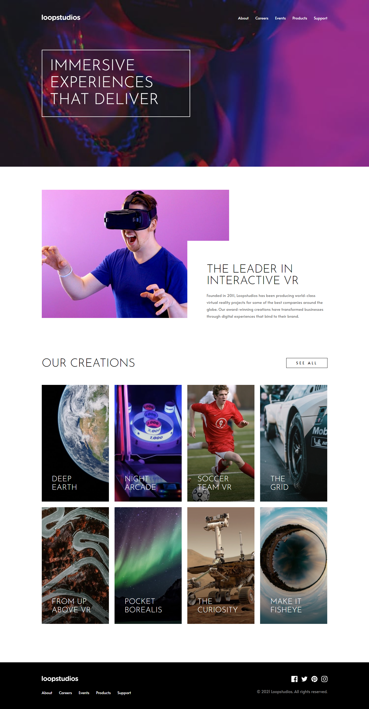

# Frontend Mentor - Loopstudios landing page solution

This is a solution to the [Loopstudios landing page challenge on Frontend Mentor](https://www.frontendmentor.io/challenges/loopstudios-landing-page-N88J5Onjw). Frontend Mentor challenges help you improve your coding skills by building realistic projects. 

## Table of contents

- [Overview](#overview)
  - [The challenge](#the-challenge)
  - [Screenshot](#screenshot)
  - [Links](#links)
- [My process](#my-process)
  - [Built with](#built-with)
  - [What I learned](#what-i-learned)
  - [Continued development](#continued-development)
  - [Useful resources](#useful-resources)
- [Author](#author)

## Overview

### The challenge

Users should be able to:

- View the optimal layout for the site depending on their device's screen size
- See hover states for all interactive elements on the page

### Screenshot



### Links

- Solution URL: [https://github.com/Yejin-Han/Loopstudios-landing-page](https://github.com/Yejin-Han/Loopstudios-landing-page)
- Live Site URL: [https://yejin-han.github.io/Loopstudios-landing-page/](https://yejin-han.github.io/Loopstudios-landing-page/)

## My process

### Built with

- Flexbox
- Mobile-first workflow
- [BEM](https://getbem.com/) - Block Element Modifier
- [SCSS](https://styled-components.com/) - For styles

### What I learned

- [picture tag](https://codingeverybody.kr/html-picture%EC%99%80-source-%ED%83%9C%EA%B7%B8-%EB%B0%98%EC%9D%91%ED%98%95-%EC%9D%B4%EB%AF%B8%EC%A7%80-%EA%B5%AC%ED%98%84%ED%95%98%EA%B8%B0/)

```html
<picture>
  <source srcset="images/mobile/image-interactive.jpg" media="(max-width: 767px)">
  <source srcset="images/desktop/image-interactive.jpg" media="(min-width: 768px)">
  
</picture>
```

We can responsively change img src without css or javascript.

### Continued development

I want to use Mobile-first workflow once more. BEM is quite nice but it takes too long time to decide the class names, so I want to find another class naming methods. Also, this time too, I took a huge time finishing this project. Time reduction while working on the project will be my first task.

### Useful resources

- [Mobile first mediaqueries](https://velog.io/@nemo/css-media-queries) - My first time trying Mobile First styling. I referred to this blog about mediaqueries.

## Author

- Github - [Yejin Han(한예진)](https://github.com/Yejin-Han)
- Frontend Mentor - [@Yejin-Han](https://www.frontendmentor.io/profile/Yejin-Han)